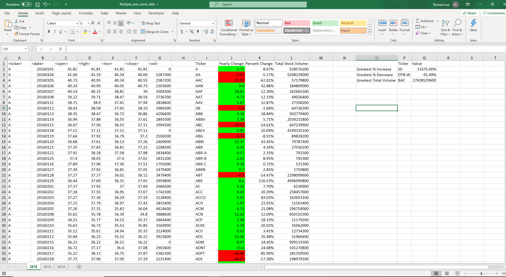

# VBA-Challenge

---

  In this Challenge I will be analyzing data from our "Multiple Year Stock Data" excel sheet. The data includes stock tickers, dates, opening prices, closing prices, highs, lows, and volume. All of this data will be coming from the years of 2014 to 2016. My analysis will include findings for each stock, which will be indicated by the ticker. I will be looking for the yearly change, the percentage of change per year, and the total stock volume per year. I will also look for the greates increase and decrease in value for each year, along with the greatest total volume for the year.
 
 Using Excel's Visual Basic for Applications I was able to make a set of code that will give me the results that I was looking for. This code can be found in the "VBA Code.bas", the code was also tested on the "alphabetical_testing.xlsm" file before used on the "Multiple Year Stock Data." This was due to how large the stock data file was. Also because the file was so large I only included a few screenshots to show a brief finding of the data. 

---
#### Results for 2014
The below image consist of my finding for the year 2014. As you can see columns A-G is the initial data i was working with, columns I-L is the analysis of the data, and column O-Q shows the greates increase/decrease, and total volume. The only issue I really ran into on this analysis is that I was not able to find the correct Greatest % Decrease. My results kept showing stock ticker "PLNT" with -100% change. This is incorrect because when I looked at the data for "PLNT" it was zero for all columns, there was no data to analyze. 

---

#### Results for 2015

---

#### Results for 2016

---
### Conclusion
When looking at these screenshots I can conclude that each year "BAC" had the greates total volume, which would make it a stock worth looking into to see why that may be. Other than "BAC" we are just seeing the yearly change for each stock between the year of 2014 to 2016, I believe if we wanted to make a more detailed analysis we would need to look at more data over a longer period of time for the stock market. What could also improve this analysis would be some adjustment in the code. I was not able to figure out how to fix the results for year 2014, but I believe that the problem lies with the fact that there was no data for "PLNT" which skewed my results.
